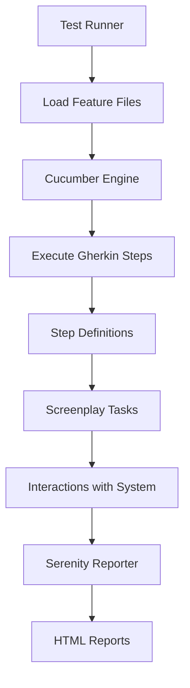

## Overview

The Makers BTG Tests framework is built on a modern, layered architecture that combines three powerful testing technologies:

- **Serenity BDD** - Provides enhanced reporting and test orchestration
- **Cucumber** - Enables behavior-driven development with Gherkin syntax
- **Screenplay Pattern** - Ensures maintainable, readable, and scalable test code

This architecture follows industry best practices and supports both UI and API testing scenarios.

## Architectural Layers

### Layer 1: Feature Files (Business Layer)

At the top level, test scenarios are written in Gherkin syntax using Spanish language keywords.

<Info>
Feature files are located in `src/test/resources/features/` and use the `.feature` extension.
</Info>

```gherkin
#language:es
Característica: Generación de reportes desde la web de Chronos

  @test
  Esquema del escenario: [Happy Path] Generacion exitosa de reporte
    Dado el usuario ingresa a la web de Chronos
    Cuando ingrese los datos del reporte "<report>" para la compañia "<company>"
    Entonces se genera el reporte "<report>" de manera exitosa
```

This layer focuses on **what** the system should do, written in business-readable language.

### Layer 2: Step Definitions (Glue Layer)

Step definitions connect Gherkin steps to executable Java code. They interpret the natural language and delegate actions to the Screenplay layer.

```java
@Dado("el usuario ingresa a la web de Chronos")
public void el_usuario_ingresa_a_la_web_de_chronos() {
    // Delegates to Screenplay Tasks
}
```

<Note>
Step definitions are located in `src/test/java/org/btg/practual/stepDefinitions/`
</Note>

### Layer 3: Screenplay Pattern (Implementation Layer)

The Screenplay pattern provides the actual test logic through:

- **Actors** - Represent users or systems under test
- **Tasks** - High-level business actions (e.g., "Login to system")
- **Interactions** - Low-level actions (e.g., "Click button", "Enter text")
- **Questions** - Queries to verify system state
- **Abilities** - Capabilities actors can use (e.g., browsing the web, calling APIs)

<Tip>
The Screenplay pattern is configured through `serenity-screenplay` and `serenity-screenplay-webdriver` dependencies.
</Tip>

### Layer 4: WebDriver & Infrastructure

Serenity BDD manages WebDriver instances automatically using Selenium Manager (enabled via `autodownload = true` in configuration).

## Test Execution Flow



### Execution Sequence

1. **JUnit Platform** discovers the `CucumberRunner` class
2. **Cucumber Engine** loads feature files from `src/test/resources/features`
3. **Glue Code** matches Gherkin steps to step definitions in `org.btg.practual.stepDefinitions`
4. **Step Definitions** execute, calling Screenplay Tasks and Interactions
5. **Serenity Reporter** captures all actions, screenshots, and results in real-time
6. **Aggregate Task** generates comprehensive HTML reports after test completion

## Runner Configuration

The `CucumberRunner` class orchestrates the entire test execution:

```java
@Suite
@IncludeEngines("cucumber")
@SelectClasspathResource("features")
@ConfigurationParameter(key = GLUE_PROPERTY_NAME, value = "org.btg.practual.stepDefinitions")
@ConfigurationParameter(key = FILTER_TAGS_PROPERTY_NAME, value = "@test")
@ConfigurationParameter(
    key = PLUGIN_PROPERTY_NAME,
    value = "io.cucumber.core.plugin.SerenityReporterParallel,pretty,html:target/cucumber-report.html"
)
public class CucumberRunner {}
```

<Accordion title="Configuration Parameters Explained">
- **@Suite** - Marks this as a JUnit Platform Suite
- **@IncludeEngines("cucumber")** - Uses Cucumber as the test engine
- **@SelectClasspathResource("features")** - Loads all .feature files from the features directory
- **GLUE_PROPERTY_NAME** - Points to package containing step definitions
- **FILTER_TAGS_PROPERTY_NAME** - Only runs scenarios tagged with `@test`
- **PLUGIN_PROPERTY_NAME** - Configures Serenity parallel reporting and Cucumber HTML output
</Accordion>

## Reporting Pipeline

### Real-time Capture

During test execution, Serenity captures:

- Step-by-step execution details
- Screenshots (configured for failures: `take.screenshots = FOR_FAILURES`)
- Browser console logs
- Network activity
- Execution timing

### Report Generation

After tests complete, the `aggregate` task processes all captured data:

```gradle
test.finalizedBy(aggregate)
```

This generates:

- **HTML Reports** - Interactive test execution reports in `target/site/serenity/`
- **Requirements Coverage** - Linked to feature files
- **Execution Timeline** - Visual representation of test flow
- **Detailed Test Results** - Pass/fail status with evidence

<CardGroup cols={2}>
  <Card title="Serenity BDD" icon="book" href="./serenity-bdd">
    Learn about Serenity BDD configuration and capabilities
  </Card>
  <Card title="Screenplay Pattern" icon="masks-theater" href="./screenplay-pattern">
    Deep dive into the Screenplay pattern implementation
  </Card>
</CardGroup>

## Configuration Management

The framework uses HOCON format configuration in `serenity.conf`:

```hocon
serenity {
    take.screenshots = FOR_FAILURES
    test.root = "org.btg.practual"
    logging = QUIET
    console.colors = true
}
```

Environment-specific settings are managed through the `environments` block, allowing easy switching between QA, STG, and production environments.

<Info>
Learn more about project structure and file organization in the [Project Structure](./project-structure) guide.
</Info>

## Key Benefits

<CardGroup cols={2}>
  <Card title="Separation of Concerns" icon="layer-group">
    Business logic, test logic, and technical implementation are clearly separated
  </Card>
  <Card title="Maintainability" icon="wrench">
    Changes to UI or business rules require minimal code updates
  </Card>
  <Card title="Readability" icon="book-open">
    Tests are readable by both technical and non-technical stakeholders
  </Card>
  <Card title="Rich Reporting" icon="chart-line">
    Serenity provides detailed reports with screenshots and execution history
  </Card>
</CardGroup>